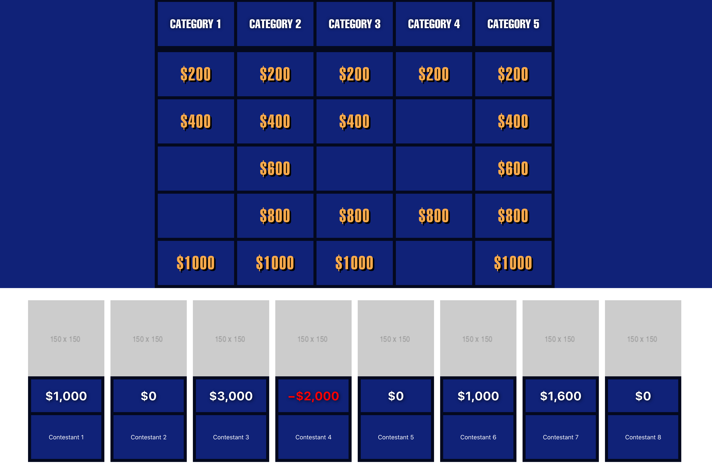

# React Jeopardy

A replacement for the Jeopardy! powerpoint slides when hosting your own local Jeopardy! games

## Features

### Supported Media Types

- 📹 Video Clues (Local, Google Drive, YouTube)
- 🎧 Audio Clues (Local, Google Drive)
- 🖼️ Image Clues
- 📝 Text Clues (obviously)

### Other

- 💯 Scorekeeping
- 👯 Automatically placed daily doubles

## Usage

### Development mode

To install dependencies: `yarn install`, then to run the app in development mode: `yarn start`.
Open http://localhost:3000 to view it in the browser.

### Production

`yarn build`

See `sampleConfigFile.json` for an example of the config file format to upload.

